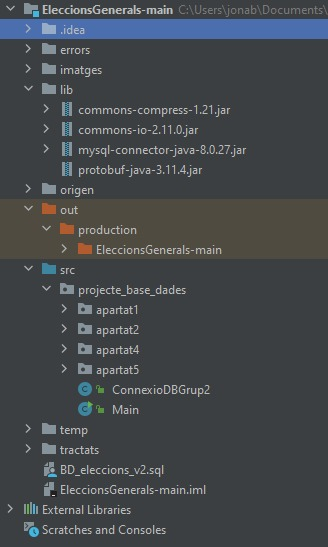

## APARTAT 3: Utilització de repositori GIT per realitzar l’activitat

### Resum:
Cal realitzar una documentació del projecte mitjançant MarkDown(.MD) i també
utilitzar el Git com a repositori de codi on cadascu fagi commits.

### Contingut:
En el principi el que es va decidir va ser fer una estructura en el git pensant en les carpetes que es farien
servir per l'extracció i tractament d'un .zip (Apartat 4). Seguidament es va aplicar, a més, l'estructura d'un 
projecte d'Intellij pensant en l'estructura d'ensamblatge, tant per les llibreries, com per les importacions i
els diferents apartats i subarpartats, de forma que quedes tal com s'observa en la imatge:

També es va realitzar una branca, denominada "EstructuraProjecteEleccions", per copiar i probar diferents 
aspectes del projecte.

### Organitzacio:
De manera conjunta, s'ha fet us també d'un grup de Whattsapp per fer un seguiment del projecte en moments
extra-escolars. També s'ha utilitzat la plataforma de Trello per controlar les tasques i el nivell de treball
de cadascu.
